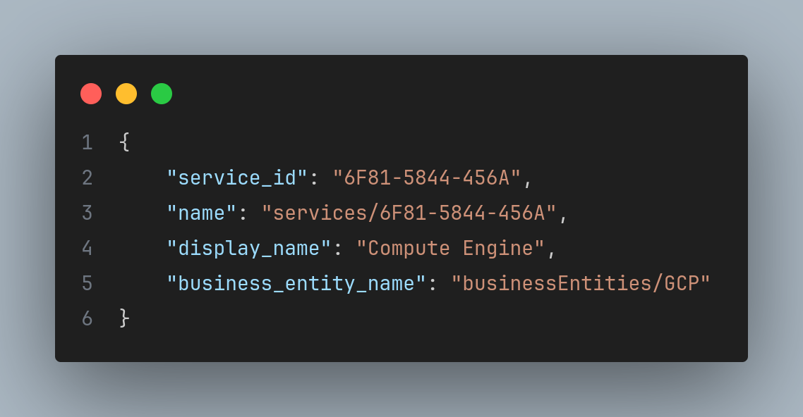
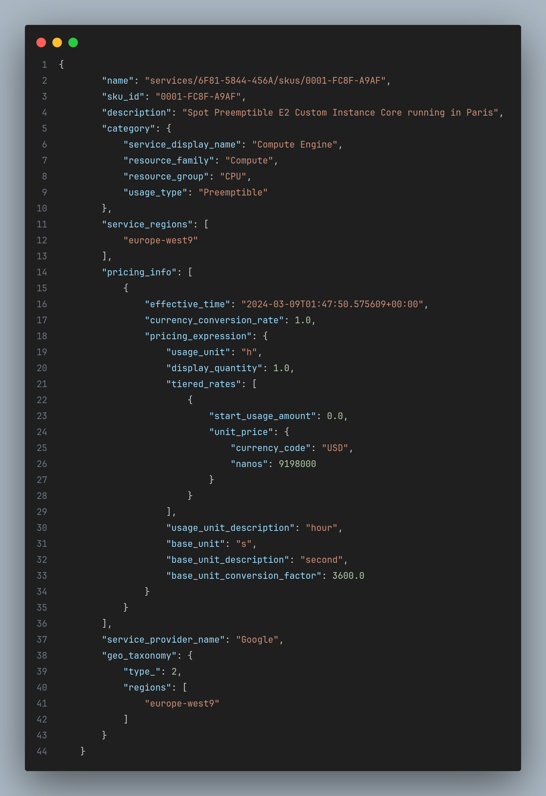

# PoC - Catalogo GCP (Google Cloud Platform)

### Requisitos:

- [Python 3.11.4](https://www.python.org/downloads/)

### Dependências:

- [Google cloud Billing](https://cloud.google.com/python/docs/reference/cloudbilling/latest)

  ⚠️ NOTA: será necessário criar um novo projeto e ativar o faturamento no Google Cloud, e habilitar a API do Cloud Billing.
  Para isso, podemos seguir a documentação da [API do Cloud Billing](https://cloud.google.com/python/docs/reference/cloudbilling/latest):

#### Criando ambiente virtual:

##### Mac/Linux:

```bash
python3 -m venv <your-env>
source <your-env>/bin/activate
```

##### Windows:

```bash
python3 -m venv <your-env>
source <your-env>/bin/activate
```

#### Instalando dependências:

```bash
pip install -r requirements.txt
```

### Execução:

```bash
python3 main.py
```

Projeto será executado, obterá uma lista de todos os serviços disponíveis no GCP, salvando os dados em um arquivo [services.json](./json/services.json).

Exemplo:



Seguindo o fluxo de execução, será obtido o serviço `Compute Engine` e filtrará todos os Skus disponíveis do serviço, salvando os dados em um arquivo [skus.json](./json/skus.json).

Exemplo:


